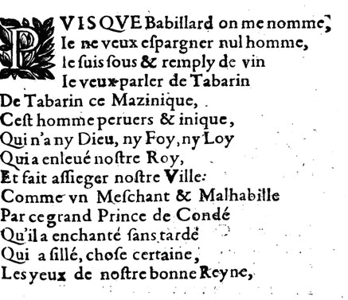

Rapport de Stage

# Couverture

Jonathan Poinhos

Université Gustave Eiffel

2019-2020

Rapport de Stage M1

* Tuteurs : 

Approches Automatiques pour la Modernisation des textes du XVIe au XVIIIe siècle

# Sommaire

[TOC]

# Table des Illustrations

* Légendées
* Numérotées
* Sourcées

# Glossaire

* NLP (Natural Language Processing)
* OCR (Optical Character Recognition)
* TAL (Traitement Automatique des Langues)
* Corpus parallèle : corpus aligné au niveau du mot, de la phrase, du paragraphe.
* Corpus comparable : corpus non-aligné mais dont les textes partagent un thème commun.
* Hapax : mot dont il n'existe qu'une seule occurrence dans un corpus donné.
* Modèle de langue : distribution statistique obtenue par apprentissage des probabilités des séquences de mots dans une langue donnée.
* Traduction inversée : vérification de traduction par retraduction d'un texte vers sa langue originale.
* Normalisation
* Modernisation
* Lemmatisation
* Transducteur
* Nom propre
  * Nom propre pur
  * Nom propre descriptif
* Entité Nommée
  * Entité nommée étendue
* Fermeture
* Fréquence
* Mot plein : mot significatif dans un texte (en français : noms, verbes, adjectifs, etc.).
* Mot vide (stop word) : mot non significatif dans un texte (en français : articles, déterminants, prépositions, etc.).
* Listes de substitution
* Approche à base de règles
* Approche à base de distances
* SMT (Statistical Machine Translation)
* NMT (Neural Machine Translation)
* RNN (Recurrent Neural Network)
* LSTM (Long Short Term Memory)
* GRU (Gated Recurrent Unit)
* BERT (Bidirectional Encoder Representations from Transformers)
* Baseline
* Gold Standard

# Préambule

* Contexte du rapport
* Façon de procéder

# Introduction

* Présentation succincte du contexte et problématique générale puis particulière
* Présentation claire du plan adopté pour la suite
* Accessible à un lecteur non spécialiste

* Contexte : la langue du XVIe

Alors que la langue se trouve en plein évolution au cours de la période du XVIe au XVIIe, il a été constaté qu’elle présente une extrême variabilité graphique (scauoir/sauoir/sçauoir/sçavoir/savoir, alternances u/v et i/j). En effet, elle conserve certains archaïsmes (amy/ami), son système flexionnel n’est pas encore stabilisé (amiz/amis, chevaulx/cheval) et l’accentuation est souvent peu régulière (Souvay & Pierrel, 2009).

* Contexte : les imprimés du XVIe

De plus ces textes anciens issus d’une océrisation dépendante de la qualité de l’impression du texte original, peuvent contenir souvent des problèmes de conversion de caractères spéciaux (s long - ſ) et sont parfois peu conformes à leur version originale (Abiven & Lejeune, 2019).

* Problématique générale

Traiter de façon automatique des anciens textes nécessiterait donc prendre en compte un certain nombre de paramètres afin d’obtenir une version modernisée : la syntaxe, la ponctuation, la conjugaison, l’OCR, etc. (Catach, 1996). Également, il ne faut pas omettre la résolution de l’ambiguïté homographique (marchez peut être utilisé comme nom au pluriel alors qu’aujourd’hui il est le plus souvent utilisé comme verbe à la deuxième personne du pluriel) qui vient s’ajouter à cette problématique.

* Problématique particulière

Quelles approches automatiques pour la modernisation des textes du XVIe siècle ?

Dans le cadre du projet de recherche Cité de Dames, créatrices dans la cité, qui se centre sur la thématique de la visibilité des créatrices sur la dimension urbaine, coordonné par Philippe Gambette et Caroline Trotot, un stage en TAL est proposé sur le sujet de la mise en œuvre d’approches statistiques et à base de règles pour la modernisation orthographique des textes issus du XVIe au XVIIIe siècle.

Les résultats de ce stage contribueront à l’amélioration du traitement automatique des corpus informatisés de textes allant du XVIe au XVIIIe siècle, notamment ceux écrits par des femmes utilisés dans le cadre du projet de recherche Cité des Dames. Les outils développés le seront sous licence libre.

Des approches à base de règles devraient être appliquées idéalement à l’aide du logiciel Unitex (Unitex 3.1), couplées avec des approches statistiques.

* Présentation claire du plan adopté pour la suite

# Notions Utiles

En traitement automatique des langues, la normalisation désigne le procédé consistant à passer d'un certain état de la langue à un autre, standardisé. Dans le cas présent, on cherche par exemple à normaliser un français historique, celui de la renaissance, en français moderne. Cette normalisation vers la langue actuelle peut également être appelée modernisation.

* Lemmatisation
* Transducteur
* Nom propre
  * Nom propre pur
  * Nom propre descriptif
* Entité Nommée
  * Entité nommée étendue
* Corpus parallèle : corpus aligné au niveau du mot, de la phrase, du paragraphe.
* Corpus comparable : corpus non-aligné mais dont les textes partagent un thème commun.

## Approches

La liste qui suit est un bref aperçu des différentes approches ayant été employées dans la modernisation de textes historiques, classées par ordre croissant de conceptualisation.

* Listes de Substitution

Également appelée substitution lexicale ou mémorisation, la forme de normalisation la plus simple consiste à compiler une liste associant chaque variante historique à sa version normalisée.

* Méthodes basées sur les règles

Les approches à base de règles consistent à déceler des motifs réguliers dans le passage de la langue historique à la langue moderne, et à en déduire des règles de remplacement de caractères. Dans le cas du français de la renaissance, le s long ſ correspond toujours à un s, bien que d'autres règles puissent s'appliquer ensuite, le s pouvant disparaître dans le cas de lettres étymologiques par exemple. L'application des règles peut dépendre du contexte, comme dans le cas des lettres ramistes, où un v historique peut représenter un u moderne.

* Méthodes basées sur la distance

* Méthodes statistiques

Modèles de langue

* Méthodes basées sur les réseaux de neurones
* Traduction inversée ?

## Outils

## Évaluation

|            |  Pas Alerte  |    Alerte    |
| ---------- | :----------: | :----------: |
| Pas Erreur | Vrai Positif | Faux Positif |
| Erreur     | Faux Négatif | Vrai Positif |

* Précision : ratio de réponses correctes

$$
Précision = \frac{Vrais\ Positifs}{Vrais\ Positifs + Faux\ Positifs}
$$

* Rappel : ratio de réponses trouvées

$$
Rappel = \frac{Vrais\ Positifs}{Vrais\ Positifs + Faux\ Négatifs}
$$

* Bruit : ratio de réponses incorrectes

$$
Bruit = 1 - Précision
$$

* Silence : ratio de réponses non trouvées

$$
Silence = 1 - Rappel
$$

* F-mesure
  * $\beta^2 = 1$ : équilibrée
  * $\beta < 1$ favorise $P$
  * $\beta > 1$ favorise $R$

$$
F_{\beta} = \frac {(1 + \beta^2) * P * R} {\beta^2 * P + R}
$$

* Wacc (Word Accuracy)
* BLEU (BiLingual Evaluation Understudy) : computes the geometric average of the modified n-gram precision, multiplied by a brevity factor that penalizes short sentences (Papineni et al., 2002).
* TER (Translation Error Rate) : computes the number of word edit operations (insertion,  substitution, deletion and swapping), normalized by the number of words in the final translation (Snover et al., 2006).
* CER (Character Error Rate) : computes the number of character edit operations (insertion, substitution and deletion), normalized by the number of characters in the final translation.
* METEOR

# État de l'Art

Sur le problème de la normalisation de textes historiques au sens large, diverses approches ont été testées : listes de substitution, méthodes basées sur des règles, méthodes basées sur les distances, modèles statistiques et modèles neuronaux. Quelques approches basées sur un niveau supérieur au simple token ont également été tentées, mais le domaine reste encore peu exploré.

Bollmann et Søgaard (2016) obtiennent avec une approche NMT des résultats encourageants et supérieurs à Norma sur un corpus allemand de taille réduite, et recommandent l'essai d'un entraînement auxiliaire sur des données similaires pour augmenter la précision.

Domingo et Casacuberta (2018) observent un avantage des approches SMT sur les approches NMT, sur des corpus en espagnol et en slovène, en particulier ceux de petite taille. Les approches au niveau du caractère s'avèrent généralement les meilleures pour les deux méthodes, à la fois SMT et NMT, avec une exception pour le cNMT qui donne des résultats inférieurs sur le plus petit des corpus.

Bollmann (2019) obtient des résultats similaires sur des corpus de huit langues différentes, excluant le français. Il recommande Norma (listes de substitution, règles et distances) uniquement sur des corpus de taille limitée (moins de 500 tokens de données d'entraînement), et cSMTiser (modèle statistique au niveau du caractère) dans le reste des cas. Le jeu de données n'inclut cependant pas le français.

[Concernant le français du XVIIe spécifiquement, Gabay et Barrault (Gabay & Barrault, 2020) obtiennent avec le NMT un score supérieur à celui du cSMT sur un corpus d'une grande hétérogénéité, proche de l'état de l'art de 90% dressé par Bollmann. Les auteurs recommandent une poursuite des recherches sur les modèles neuronaux, et leur amélioration par l'utilisation de modèles de langue et de la traduction inversée.]

# Exemple de Modernisation

| Manuscrit                                         | Océrisation                                                  |
| ------------------------------------------------- | ------------------------------------------------------------ |
|  | VIS QVE Babillard on me nomme JnlËflP le ne veux efpargner nul homme, WjfflsL le fuis fous & remply de vin Icvcuxrparlcr deTabarin DeTabarin ce Mazinique, . Cefthomrnepcruers & inique, Qiii n’any Dieu, nyFoy.nyLoy Quiaenleuénoftre Roy, . Et fait affieger noftrc Ville : Commcrvn Mefchant ôC Malhabille Par ce grand Prince de Condé Qu’il a enchanté fans tarde* J Qui a fille, chofe certaine. Les yeux de noftre bonne Rey ne, |

*Océrisation sans post-traitement d'un extrait de manuscrit : le Babillard du Temps, Paris, N. de la Vigne, 1649*

| Transcription originale                                      | Transcription moderne                                        |
| ------------------------------------------------------------ | ------------------------------------------------------------ |
| PVISQVE Babillard on me nomme, Ie ne veux eſpargner nul homme, Ie ſuis ſous & remply de vin Ie veux parler de Tabarin De Tabarin ce Mazinique, Ceſt homme peruers & inique, Qui n’a ny Dieu, ny Foy, ny Loy Qui à enleué noſtre Roy, Et fait aſſieger noſtre Ville Comme vn Meſchant & Malhabille Par ce grand Prince de Condé Qu’il a enchanté ſans tardé Qui a ſillé, choſe certaine, Les yeux de noſtre bonne Reyne, | PUISQUE Babillard on me nomme Je ne veux épargner nul homme, Je suis saoul, et rempli de vin, Je veux parler de Tabarin, De Tabarin ce mazinique, Cet homme pervers et inique, Qui n’a ni Dieu, ni foi, ni loi, Qui a enlevé notre Roi, Et fait assiéger notre Ville Comme un méchant et malhabile Par ce grand Prince de Condé Qu’il a enchanté sans tarder, Qui a sillé, chose certaine, Les yeux de notre bonne Reine, |

*Transcription fidèle et transcription moderne*

| Modernisation                    | Problèmes                                                    |
| -------------------------------- | ------------------------------------------------------------ |
| pvisqve → puisque                | lettre ramiste (u → v)                                       |
| ie → je                          | lettre ramiste (u → v)                                       |
| eſpargner → espargner → épargner | lettre archaïque (ſ → s) lettre étymologique (s → ε) accent (e → é) |
| ſuis → suis                      | lettre archaïque (ſ → s)                                     |
| ſous → saoul                     | lettre archaïque (ſ → s)                                     |
| & → et                           | lettre archaïque (& → et)                                    |
| remply → rempli                  | lettre calligraphique (y → i)                                |
| ceſt → cet                       | lettre archaïque (ſ → s) lettre étymologique (s → ε)    |
| peruers → pervers                | lettre ramiste (u → v)                                       |
| ny → ni                          | lettre calligraphique (y → i)                                |
| Foy → foi                        | modernisation de la casse (F → f) lettre calligraphique (y → i) |
| Loy → loi                        | modernisation de la casse (L → f) lettre calligraphique (y → i) |
| à → a                            | conjugaison / accentuation (à → a)                           |
| enleué → enlevé                  | lettre ramiste (u → v)                                       |
| noſtre → notre                   | lettre archaïque (ſ → s) lettre étymologique (s → ε)    |
| Roy → roi                        | casse (R → r) lettre calligraphique (y → i)             |
| aſſieger → assiéger              | lettre archaïque (ſ → s)                                     |
| vn → un                          | lettre ramiste (v → u)                                       |
| Meſchant → méchant               | lettre archaïque (ſ → s) lettre étymologique (s → ε) accent (e → é) |
| Malhabille → malhabile           | casse (M → m) lettres consécutives (ll → l)             |
| ſans → sans                      | lettre archaïque (ſ → s)                                     |
| tardé → tarder                   | voyelle finale (é → er)                                      |
| ſillé → sillé                    | lettre archaïque (ſ → s)                                     |
| choſe → chose                    | lettre archaïque (ſ → s)                                     |
| Reyne → reine                    | casse (R → r) lettre calligraphique (y → i)             |

# Solutions

| Problème                                                     | Exemple                                          | Solution                    |
| ------------------------------------------------------------ | ------------------------------------------------ | --------------------------- |
| lettres ramistes                                             | vn → un ie → je                             |                             |
| lettres archaïques                                           | & → et ſecours → secours                    |                             |
| lettres étymologiques                                        | lat. voster → frm. vostre → votre                |                             |
| lettres calligraphiques                                      | j'ay → j'ai                                      |                             |
| lettres consécutives                                         | désaprendre → désapprendre allarme → alarme |                             |
| hyphénation                                                  | long-temps → longtemps                           | caractères de "raccrochage" |
| segmentation                                                 | sur tout → surtout                               | caractères de "raccrochage" |
| modernisation du lexique                                     |                                                  |                             |
| modernisation de la casse                                    |                                                  |                             |
| modernisation de la phonétique                               | craignois → craignais                            |                             |
| modernisation de la conjugaison                              | tardé → tarder                                   |                             |
| modernisation des accords (adjectifs et participes passés) |                                                  |                             |
| modernisation des accents                                    | ame → âme                                        |                             |
| voyelle finale                                               | festoyé → festoyer                               |                             |

## Sous-Problématique

* Définir

* Proposer une approche

* Évaluer l'approche

# Résolution du Problème Global

## Description de la Combinaison des Solutions

## Évaluation de l'Approche Globale

# Conclusion

* Objectifs atteints
* Réponse à l'introduction et la problématique
* Utilité et pérennité du travail
* Perspectives

# Bibliographie

# Annexes

# Résumé

* Contexte
* Problématique
* Résultats

* FR + EN
* Mots-clés axes fondamentaux du rapport